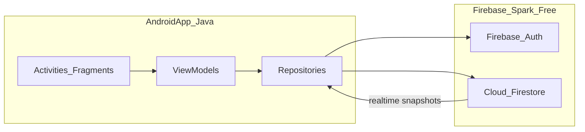
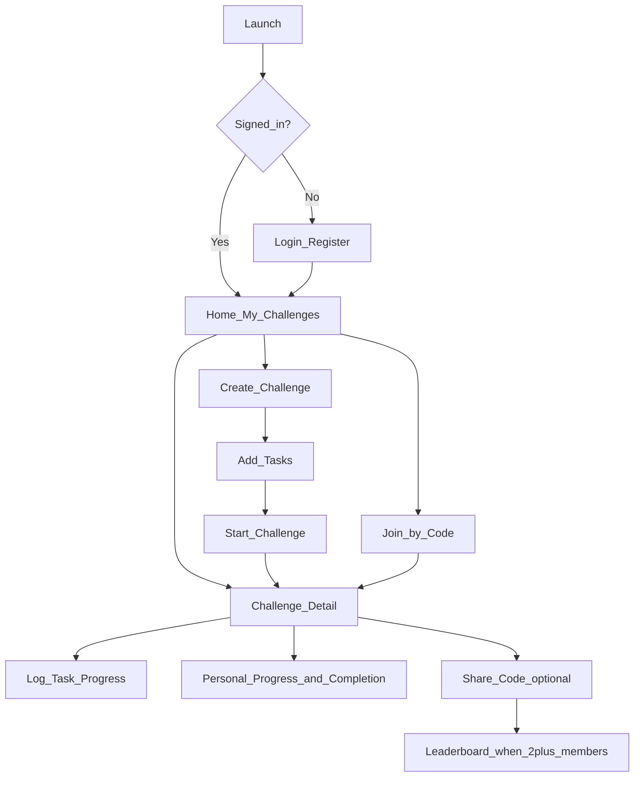

# Android Challenge App — Architecture and MVP Plan

## Your choices (locked in)

- **Solo-first (required):** Every challenge must be fully usable by one person alone — create, start, log progress, and complete without inviting anyone or generating a share code.
- **MVP social scope (optional add-on):** Share a challenge via code/link; friends join the same challenge and see a leaderboard + each other's progress.
- **Connectivity:** Online-only for v1 (simpler, faster to ship).
- **Workspace:** Empty — greenfield project at [`c:\Users\Corner\Documents\challenge`](c:\Users\Corner\Documents\challenge).

---

## Solo-first design (core requirement)

Solo is the default path, not a fallback. Social features layer on top without blocking solo use.

**How solo works end-to-end:**

1. User creates a challenge and adds tasks (daily/weekly/monthly mix).
2. User taps **Start challenge** — creator is automatically the only member (`memberIds` includes their `userId` on create/start).
3. User logs progress on the challenge detail screen (checkmarks, numeric targets, etc.).
4. App shows **personal progress** — completion %, streaks, tasks done vs expected for the current period.
5. When all expected task periods are met (or duration ends), challenge status becomes `completed` with a solo completion summary.

**No social steps required:** Share code, join flow, and leaderboard are never shown as mandatory. They appear only as optional actions (e.g. "Invite friends" on challenge detail when the user wants to compete).

**UI behavior for solo vs group:**

| Context | What the user sees |
|---------|-------------------|
| Solo (1 member) | Personal progress dashboard, task checklist, completion % — **no empty leaderboard** |
| Group (2+ members) | Same progress UI + leaderboard tab ranking members |

**Implementation notes:**

- On challenge create/start: auto-add `createdBy` to `memberIds` so progress rules work with one user.
- `shareCode` is generated lazily (only when user taps Share), not required to start.
- Home screen lists "My challenges" — no distinction needed between solo-created vs joined; both are fully trackable.
- Phase 2–3 (create + progress) deliver full solo value **before** Phase 4 (share/join) is built.

---

## Language: Java vs Kotlin

| | **Java (your preference)** | **Kotlin (recommended alternative)** |
|---|---|---|
| Fit for you | You can move faster today with familiar syntax | Small learning curve; Google’s default for new Android docs/samples |
| Android ecosystem | Fully supported | Slightly better library/docs coverage |
| Boilerplate | More (listeners, null checks) | Less; coroutines simplify async/Firebase callbacks |
| Long-term | Fine | Better default for new Android projects in 2026 |

**Recommendation:** Start in **Java** since you’re comfortable with it and MVP scope is manageable. If you hit pain with Firebase callbacks or UI state, we can introduce Kotlin gradually (Android projects support both in the same app). No need to switch unless you want to.

---

## Backend: free database + user management

**Recommended: [Firebase](https://firebase.google.com/) Spark plan (free, no credit card for basic use)**

Why it fits this app:

- **Authentication** — Email/password + Google Sign-In out of the box.
- **Cloud Firestore** — Document DB with **real-time listeners** (leaderboards and “who completed what today” update live).
- **Security Rules** — Enforce “only challenge members can read/write progress.”
- **Android SDK** — First-class Java support, minimal backend code to write.
- **Cost** — Spark tier stays free for personal/small-group use (limits like ~50K reads/day — plenty for MVP and friends).

**Free-tier limits to know:** Not unlimited at scale; if you ever outgrow Spark, you’d migrate or pay. For “challenge your friends” usage, it effectively stays free.

**Alternative: [Supabase](https://supabase.com/) free tier**

- PostgreSQL + Auth + Realtime; good if you prefer SQL and relational modeling.
- More setup (REST/RPC, RLS policies) than Firebase for the same MVP.
- Choose this if you already know SQL well and want relational queries; otherwise Firebase is faster for v1.

**Not recommended for MVP:** Self-hosted (Appwrite/PocketBase) — more ops work for little gain at this stage.



---

## Core data model (Firestore)

Collections and key fields:

**`users`** `{ userId }`
- `displayName`, `photoUrl`, `createdAt`

**`challenges`** `{ challengeId }`
- `title`, `description`, `createdBy`, `durationDays` (e.g. 30, 90, 7, or custom)
- `startDate`, `endDate`, `status`: `draft` | `active` | `completed`
- `shareCode`: optional; generated on first Share (null until then — solo users never need one)
- `memberIds`: array of user IDs; **creator auto-added on create** (solo works from day one)

**`challenges/{challengeId}/tasks`** `{ taskId }`
- `title`, `description`
- `frequency`: `daily` | `weekly` | `monthly`
- `taskType`: `checkmark` | `numeric` | `duration`
- `targetValue` + `unit` (e.g. 20, `"pages"`; 10000, `"steps"`; 2000, `"kcal"`)
- `orderIndex`

**`challenges/{challengeId}/progress`** `{ progressId }` (or subcollection per user)
- `userId`, `taskId`, `periodKey` (e.g. `2026-07-05` daily, `2026-W27` weekly, `2026-07` monthly)
- `value` (numeric progress), `completed` (bool), `updatedAt`

**Leaderboard (computed client-side for MVP):**
- For each member, aggregate completions vs expected periods since `startDate`.
- Sort by completion % or total points; listen to `progress` in real time.

**Share flow:**
1. Creator publishes challenge → generates `shareCode`.
2. Friend enters code → app looks up challenge by `shareCode` → adds `userId` to `memberIds`.
3. Both see same challenge detail + leaderboard.

---

## App architecture (Android)

- **Pattern:** MVVM + Repository
- **UI:** Material Design 3, single-activity + fragments (or Jetpack Navigation)
- **Libraries:**
  - Firebase Auth + Firestore BOM
  - ViewModel + LiveData (Java-friendly; no coroutines required)
  - RecyclerView for task lists and leaderboard
  - Optional later: Room (only if you add offline sync in v2)

**Package layout (suggested):**

```
com.yourname.takecontrol/
  data/          # Firestore repositories, models
  ui/
    auth/
    home/
    challenge/   # create, detail, join
    task/        # log progress
  util/          # periodKey helpers (daily/weekly/monthly)
```

**Period logic (important):** One utility class maps “today” → correct `periodKey` per task frequency so daily/weekly/monthly tasks in the same challenge stay consistent.

---

## MVP screens and flows



| Screen | Purpose |
|--------|---------|
| Login / Register | Email + Google sign-in |
| Home | Active challenges (created + joined) |
| Create challenge | Title, duration (30/90/7/custom days), start date |
| Add / edit tasks | Mix daily, weekly, monthly tasks with targets |
| Challenge detail | Task list for current period, personal progress %, completion status |
| Log progress | Mark complete or enter number (pages, steps, etc.) — **core solo loop** |
| Start challenge | Activates challenge for solo use immediately (no invite required) |
| Join challenge | Optional — enter share code to join someone else's challenge |
| Leaderboard | Optional — shown only when 2+ members; hidden for solo |
| Share | Optional — copy/share code when user wants to invite friends |

**Explicitly out of MVP (v2+):** Offline sync, friend lists, activity feed, push reminders, challenge templates marketplace, custom avatars.

---

## App naming

| Name | Pros | Cons |
|------|------|------|
| **Take Control** | Strong motivation; matches your “use time intentionally” goal | Generic; harder trademark/domain |
| **Challenge Yourself** | Clear purpose | Very common phrase; SEO/noise |
| **StreakForge** | Distinct, brandable | Less literal |
| **Period** / **Cadence** | Short, modern | Less emotional |

**Recommendation:** **Take Control** as display name, with package `com.yourname.takecontrol` and Play Store subtitle: *“30-day challenges with friends.”* Verify Play Store uniqueness before finalizing.

---

## Implementation phases (after Android Studio is installed)

### Phase 0 — Environment
- Install Android Studio, SDK 34+, emulator or physical device.
- Create Firebase project; add Android app; download `google-services.json`.
- Enable Auth (Email + Google) and Firestore.

### Phase 1 — Project skeleton
- New Empty Activity project, **Java**, minSdk 26, Material 3 theme.
- Add Firebase BOM, Auth, Firestore dependencies.
- Basic auth screens + signed-in home placeholder.

### Phase 2 — Challenge CRUD (solo-ready)
- Models + `ChallengeRepository` (Firestore).
- Create challenge wizard + task editor (frequency, type, target).
- Auto-add creator to `memberIds` on create.
- Home list of user’s challenges.
- **Start challenge** action (draft → active).

### Phase 3 — Progress + periods (solo-complete)
- `PeriodKeyUtil` for daily/weekly/monthly keys.
- Log progress UI; show today’s/this week’s tasks on detail screen.
- Personal completion % and challenge `completed` status when done.
- Firestore security rules for members-only access.
- **Milestone:** App is fully usable solo after this phase.

### Phase 4 — Share + join + leaderboard (optional social layer)
- Generate/read `shareCode`; join flow adds user to `memberIds`.
- Real-time leaderboard fragment (aggregate progress per member).
- Share sheet (copy code).

### Phase 5 — Polish
- Empty states, validation, error toasts.
- Simple rules: can’t edit tasks after challenge starts (or creator-only edits).
- Manual test checklist: **solo flow (1 account)** + social flow (2 accounts).

---

## Firestore security rules (sketch)

- Users can read/write their own `users/{userId}` doc.
- Challenge read: user in `memberIds` OR creator.
- Challenge write: creator only (while `draft`); members can write only their own `progress` docs.
- `shareCode` lookup: allow read on challenges where joining (controlled join Cloud Function optional; for MVP, client join with rule check is OK if code is unguessable enough).

We will tighten rules before any public release.

---

## What I’ll need from you when we start building

1. Android Studio finished installing.
2. Final app name (Take Control vs Challenge Yourself).
3. Firebase project created (or we walk through it step-by-step).
4. Google Play–style package name (e.g. `com.corner.takecontrol`).

---

## Summary

- **App:** Java Android, MVVM, Material 3, online-only MVP.
- **Backend:** Firebase Spark — Auth + Firestore (real-time leaderboard when social is used).
- **Solo-first MVP:** Create challenge → add tasks → start → log progress → see personal completion — **no sharing required**.
- **Optional social:** Share code → friends join → live leaderboard (only when 2+ members).
- **Kotlin:** Optional later upgrade; Java is fine to start given your familiarity.
